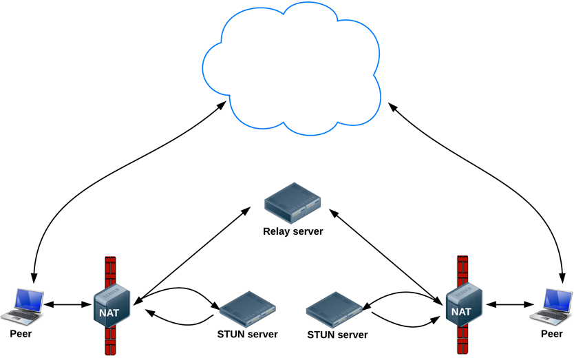
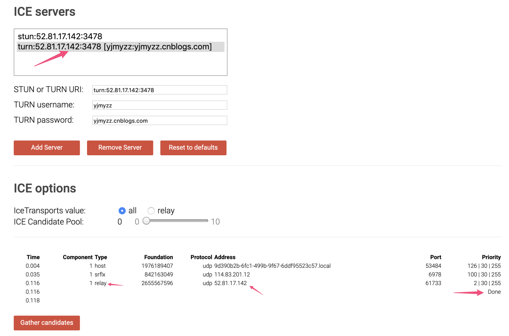

# 基于webrtc的小型直播教室

## 一、 相关技术栈
    + WebRTC - P2P媒体流传输
    + coturn - ICE, STUN, TURN服务器
    + SocketIO - 实现webrtc信令功能与基本IM功能
    + H5 Web API: 视频音频流获取 Navigator, MediaStream, etc.
    + Vue.js - 前端框架


## 二、运行步骤
1. 安装项目依赖
 
    > npm install 

2. 打包
    > npm run-script build

3. 运行
    > npm start

4. 如果想外网实现直播，需要注意以下两点：
   a) 本地获取视频流，需要https域名，或者chrome->设置->信任你的站点 否则navigator.mediaDevices为undifined。
   > 设置方法chrome打开: chrome://flags/#unsafely-treat-insecure-origin-as-secure

   b) 服务器部署coturn，保证P2P正确寻址，否则clients间可能因为内网隔离找不到对方。 可以docker一步部署, 具体步骤参见[kurento-coturn](https://github.com/konoui/kurento-coturn-docker/tree/master/coturn)
   > docker run --network=host kurento/coturn   

## 三、项目结构
 项目中有一些express模板文件没来得及删，下面将核心代码目录结构进行介绍：(本项目编写前推荐观看b站云加老师免费课程，过一遍5个小时，收益匪浅。[课程link](https://www.bilibili.com/video/av77467480)，[课程源码](https://github.com/plter/HTML5MediaCourse2019))

 - root
   - bin
     - www *#socketio服务*
   - FrontProjects
     - commons
       - components
         - ClientLists *#聊天室人员列表*
         - MessageList *#聊天框实现*
       - Barrange.js *#弹幕简单实现*
       - Dialog.js *#对话框modal框*
     - Student
       - controller *#学生相关逻辑*
       - view
     - Teacher
       - controller *#老师相关逻辑*
       - view
       - net *#管理与client的链接*
   - public *#一些依赖与打包后文件*
     - vue, socketio, ... libs
     - packed js, htmls
   - source 
     - SocketIOSupport.js
   - package.json *#依赖管理*
   - webpack.config.js *#打包配置*

## 四、原理介绍
1. WebRTC   
   [webrtc](https://developer.mozilla.org/zh-CN/docs/Web/API/WebRTC_API/WebRTC_Basics) 是google推出的基于浏览器的实时语音-视频通讯架构。其典型的应用场景为：浏览器之间端到端(p2p)实时视频对话，但由于网络环境的复杂性(比如：路由器/交换机/防火墙等），浏览器与浏览器很多时候无法建立p2p连接，只能通过公网上的中继服务器(也就是所谓的turn服务器)中转。示例图如下：
    
    <center>Fig1. webrtc通信结构</center>

    上图中的Relay server即为turn中继服务器，而STUN server的作用是通过收集NAT背后peer端(即：躲在路由器或交换机后的电脑）对外暴露出来的ip和端口，找到一条可穿透路由器的链路，俗称“打洞”。stun/turn服务器通常要部署在公网上，能被所有peer端访问到，coturn开源项目同时实现了stun和turn服务的功能，是webrtc应用的必备首选，通信流程如下图所示：([引自 blog](https://blog.csdn.net/zhuiyuanqingya/article/details/81712851))
    
    <center>Fig1.2 webrtc通信流程</center>

    (1) Client A 创建一个 PeerConnection 对象，然后打开本地音视频设备，将音视频数据封装成 MediaStream 添加到 PeerConnection 中；

    (2) Client A 调用 PeerConnection 的CreateOffer 方法创建一个 offer 的 SDP 对象，SDP 对象中保存当前音视频的相关参数；

    (3) Client A 调用 SetLocalDescription 方法将 SDP 保存起来；
    
    (4) Client A 通过信令机制将自己的 SDP 发送给 Client B;
    (5) Client B 接收到 Client A 发送过来的 offer SDP对象，通过自己的 PeerConnection 的 SetRemoteDescription 方法将其保存起来;

    (6) Client B 调用 PeerConnection 的 CreateAnswer 方法创建一个应答的 SDP 对象；

    (7) Client B 调用 SetLocalDescription 方法保存 answer SDP 对象；

    (8) Client B 通过信令机制将自己的 SDP 发送给 Client A;

    (9) Client A 调用 PeerConnection 对象的 SetRemoteDescription 方法保存 Client B 发来的 SDP；

    (10) 在 SDP 信息的 offer/answer 流程中，Client A 和Client B 已经根据 SDP 信息创建好相应的音频Channel和视频Channel 并开启 Candidate 数据的收集，Candidate 数据可以简单地理解成 Client 端的 IP 地址信息（本地 IP 地址、公网IP地址、Relay 服务端分配的地址）；

    (11) Client A 收集到自己的 Candidate 信息后，PeerConnection 会通过 OnIceCandidate 接口给 Client A 发送通知；

    (12) Client A 将收集到的 Candidate 信息通过信令机制发送给 Client B；

    (13) Client B 通过 PeerConnection 的 AddIceCandidate 方法将 Client A 的 Candidate 保存起来；

    (14) Client B 收集自己的 Candidate 信息，PeerConnection 通过 OnIceCandidate 接口给 Client B 发送通知；

    (15) Client B 将收集到的 Candidate 信息通过信令机制发送给 Client A；

    (16) Client A 通过 PeerConnection 的 AddIceCandidate 方法将 Client B Candidate 保存起来。

    至此，Client A 和 Client B 就建立了点对点的连接。备注：通信双方都必须有自己独立的 PeerConnection 对象。[引自blog](https://blog.csdn.net/zhuiyuanqingya/article/details/81712851)

    **coturn部署:** 为了简化部署，我采用了docker部署，第二章中有介绍，如果想手动部署，可参见[coturn ubuntu deploy](https://cloud.tencent.com/developer/article/1460709)。

    coturn部署后测试地址 https://webrtc.github.io/samples/src/content/peerconnection/trickle-ice/ice
    ，切记要出现relay done。（*！！！本人在此耽误了整整一天*）。
    <center> Fig1.3 测试你的coturn</center>

2. H5 Web API 获取本地视频音频
   + [Navigator 官方文档](https://developer.mozilla.org/zh-CN/docs/Web/API/Navigator)
  
   + [MediaStream 官方文档](https://developer.mozilla.org/zh-CN/docs/Web/API/MediaStream)

    ```js
    //获取本机设备
    await navigator.mediaDevices.enumerateDevices()
    # (6) [InputDeviceInfo, InputDeviceInfo, InputDeviceInfo, MediaDeviceInfo, MediaDeviceInfo, MediaDeviceInfo]

    //获取屏幕流
    await navigator.mediaDevices.getDisplayMedia({audio: true, video: true});

    //获取camera
    await navigator.mediaDevices.getUserMedia({audio: true, video: true})
    ```

    合并多个媒体流[multistreamsmixer](https://github.com/muaz-khan/MultiStreamsMixer)
   
3. SocketIO实现简单信令系统，及聊天功能
   
   SocketIO 在项目中充当 Fig1.2中的 **Signal Server** 的职责, 负责告知双方client的SDP（Session Description Protocol)、(IceCandidate)信息，此外还提供一些IM功能（创建、加入房间、发送消息等）。具体逻辑比较简单，看代码即可，此处不再赘述。

4. 弹幕实现
   
   弹幕基于 div 下生成 span 子节点并通过定时器修改 span.style.left 的值来简单实现。此外还有更好的实现方式，由于不是本项目重点，可自行搜索。
   
5. 一些其他可能遇见的问题

    + RTCPeerConnection iceserver配置
        ```js
        let servers = {
            'iceServers': [
                {
                    'url': 'stun:your_hostname',
                },
                {
                    'url': 'turn:your_hostname',
                    'username': 'your_username',
                    'credential': 'your_pwd'
                }
            ]
        };
        this._offerPc = new RTCPeerConnection(servers);

        ```
    + socketio 反向代理配置
        ```js
        // '/live/' 为反向代理的path
        this._socket = io('wss://your_hostname', { path: '/live/socket.io'})
        ```
## 特别说明

 本文来自于多篇老师的博客与自己的一些思考，刚接触这个领域，欢迎大家有问题通过issue指出，也欢迎一起完善这个小demo。如果觉得还不错，记得 **Star** ！